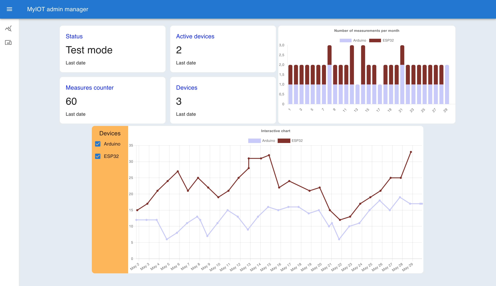
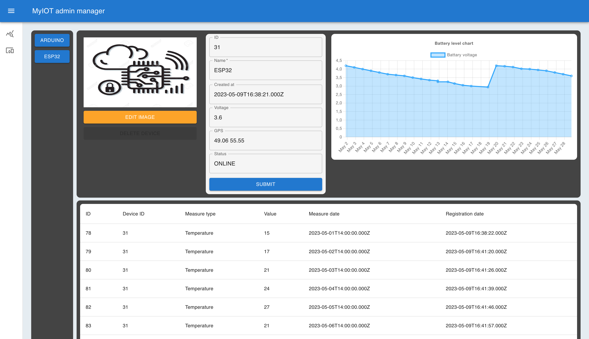

# MyIOT Admin panel MUI
##### Панель управления IOT устройствами и аналитики данных
### Описание 
Представляет собой одностраничное веб-приложение, слущащее для отображения и анализа данных, полученных от устройств интернет вещей.  
Устройства по своей внутренней программе делают замер, формируют JSON - обект и отправляют его на сервер, получая в ответ о сервера статус код.  
Сервер принимает JSON - обект, валидирует данные и сохраняет данные на удаленную SQL базу данных. Также, сервер принимает запросы от веб-приложения по получению или изменению данных БД.
### Сущности
* IOT - устройства - микроконтроллерные автономные устройства c архитектурой ARM(Adruino), Tensilica(ESP32, ESP8266), служащие для выполнения замеров параметров окружающей среды и отправки данных на сервер по протоколу http.
* Back-end - серверное node.js приложение, служащее для получения и сохранении в БД замеров IOT-устройств, а также обработки запросов, приходящих со стороны веб-приложения.
* SQL DataBase - реляционная база данных, предназначенная для хранения данных, полученных от IOT-устройств. Взаимодействие с серверным node.js приложением осуществляется при помощи node.js ORM библиотеки Sequelize.
* Amazon EC2 - сервис для хостинга серверного node.js приложения и базы данных. Развертывание осуществляется при помощи образов Docker.
## Скриншоты приложения
### Вкладка аналитики

### Вкладка состояния утройств

## Используемые технологии
* React
* react-router-dom
* Tanstack Query
* Formik
* Yup
* ChartJS
* Material UI
